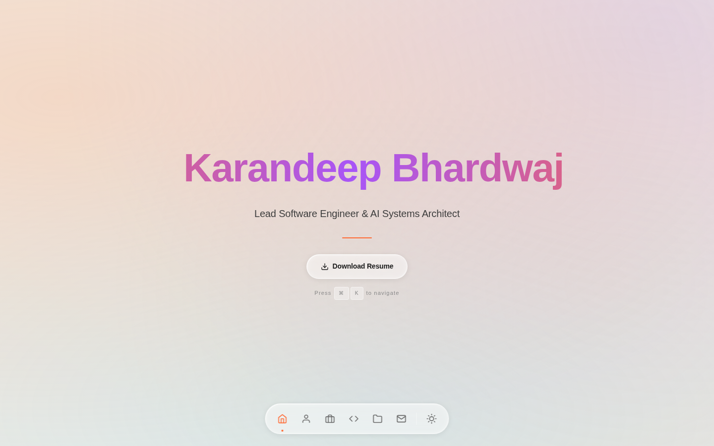
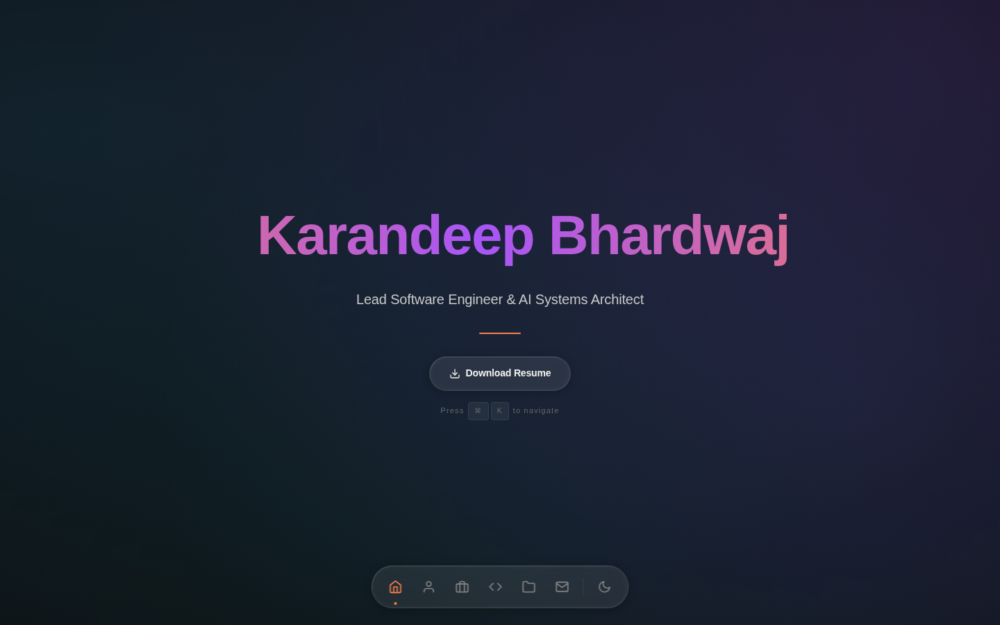
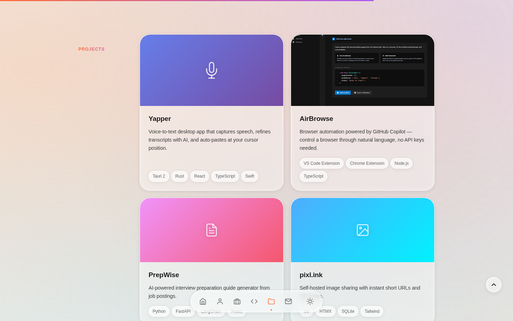
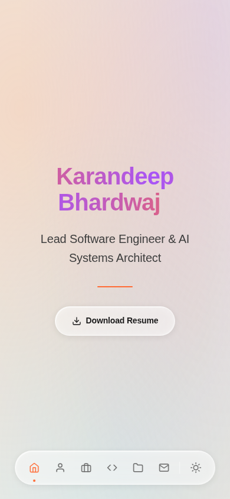

# karandeepbhardwaj.me

[](https://github.com/karandeepbhardwaj/karandeepbhardwaj.github.io/actions/workflows/ci.yml)
[](https://github.com/karandeepbhardwaj/karandeepbhardwaj.github.io/actions/workflows/security-headers.yml)
[](https://karandeepbhardwaj.me)
[](https://karandeepbhardwaj.me)
[](https://validator.w3.org/nu/?doc=https%3A%2F%2Fkarandeepbhardwaj.me%2F)

Personal portfolio website for **Karandeep Bhardwaj** — Lead Software Engineer & AI Systems Architect.

Built with zero frameworks, zero build tools — just vanilla HTML, CSS, and modular ES6 JavaScript with a **Liquid Glass** design system inspired by iOS.

> **[karandeepbhardwaj.me](https://karandeepbhardwaj.me)**

---

## Preview

### Light Mode

<p align="center">
  
</p>

### Dark Mode

<p align="center">
  
</p>

### Projects — Bento Grid

<p align="center">
  
</p>

### Mobile

<p align="center">
  
</p>

---

## Design System — Liquid Glass

The entire UI is built on a custom **Liquid Glass** design system featuring:

- **Glass morphism** — frosted glass panels with `backdrop-filter: blur()`, layered inner/outer shadows, and border highlights
- **Animated mesh gradient background** — 4-layer radial gradient mesh with continuous 25s oscillation
- **Dual-theme support** — warm light theme (`#f0eee6`) and deep dark theme (`#0e0e12`) with independent glass tinting
- **CSS design tokens** — spacing scale, typography scale, color palette, and transition presets all managed via CSS custom properties
- **Glass component variants** — `.glass-panel` (large cards), `.glass-pill` (tags/nav), `.glass-button` (CTAs)

---

## Features

### Sections

| Section | Description |
|---------|-------------|
| **Hero** | Full-viewport intro with typing animation, animated gradient text, and CTA buttons |
| **About** | Professional summary with 3-column detail grid (location, education, certification) |
| **Experience** | Timeline of 4 roles with detailed achievements |
| **Skills** | 6 categories, 50+ skill tags with staggered scroll-reveal animation |
| **Projects** | Bento grid showcasing 4 open-source projects with gradient hero areas and tech tags |
| **Education** | Academic background and certifications |
| **Contact** | Glass-styled form powered by Formspree |

### Interactive Effects

| Effect | Description |
|--------|-------------|
| **Command Palette** | `Cmd/Ctrl + K` to open — search, navigate sections, toggle theme, download resume |
| **Floating Navigation** | Fixed bottom-center glass pill nav with active section tracking |
| **3D Tilt Cards** | Subtle perspective transforms on project card hover |
| **Magnetic Buttons** | CTA buttons subtly follow the cursor before snapping back |
| **Cursor Spotlight** | Radial glow following the mouse across the page, theme-aware |
| **Scroll Progress Bar** | Thin accent-to-purple gradient bar at top of viewport |
| **Text Gradient Animation** | Animated gradient on hero title and section labels |
| **Glass Light Reflections** | Mouse-reactive caustic light overlays on glass surfaces |
| **Scroll-Driven Animations** | Native CSS `animation-timeline: scroll()` with JS fallback |

### Performance & Accessibility

- Critical CSS inlined, full stylesheet async-loaded
- Non-critical effects deferred via `requestIdleCallback`
- All interactive effects disabled on touch devices (`pointer: fine` guard)
- Full `prefers-reduced-motion` support — disables all animations
- Passive scroll listeners for 60fps scrolling
- PWA with Service Worker (stale-while-revalidate caching)
- ARIA labels on all interactive elements

---

## Tech Stack

| Layer | Technology |
|-------|-----------|
| **Markup** | Semantic HTML5 |
| **Styling** | Custom CSS with CSS Custom Properties, Grid, Flexbox, `@supports`, `clamp()` |
| **JavaScript** | Vanilla ES6 modules (no transpilation, no bundling) |
| **Hosting** | GitHub Pages with custom domain + HTTPS |
| **PWA** | Service Worker, Web App Manifest |
| **Analytics** | Google Analytics (GA4) |
| **Contact** | Formspree |
| **CI/CD** | GitHub Actions (HTML validation, broken link check, Lighthouse, security headers) |

---

## Architecture

```
karandeepbhardwaj.github.io/
├── index.html                  # Single-page app (semantic HTML)
├── style.css                   # Liquid Glass design system + all styles
├── js/
│   ├── main.js                 # Entry point — module orchestration
│   ├── theme.js                # Dark/light toggle + system preference detection
│   ├── navigation.js           # Floating nav, scroll tracking, smooth scroll
│   ├── animations.js           # Typing effect, scroll animations, progress bar
│   ├── command-palette.js      # Cmd+K keyboard navigation
│   ├── glass-effects.js        # Mouse-reactive glass light reflections
│   ├── tilt-effect.js          # 3D perspective tilt on project cards
│   ├── magnetic-effect.js      # Magnetic button pull effect
│   └── cursor-spotlight.js     # Page-wide cursor radial glow
├── images/
│   ├── projects/               # Project screenshots
│   ├── preview-light.png       # README screenshot (light mode)
│   ├── preview-dark.png        # README screenshot (dark mode)
│   ├── preview-projects.png    # README screenshot (projects section)
│   └── preview-mobile.png      # README screenshot (mobile)
├── sw.js                       # Service Worker (caching strategy)
├── manifest.json               # PWA manifest
├── 404.html                    # Custom 404 page
└── .github/workflows/
    ├── ci.yml                  # HTML validation + Lighthouse + link check
    └── security-headers.yml    # Weekly HTTPS/SSL verification
```

---

## Security

- **HTTPS enforced** via GitHub Pages + Let's Encrypt
- **Content Security Policy (CSP)** via `<meta>` tag — script-src, style-src, img-src, connect-src, frame-ancestors all locked down
- **Referrer Policy** — `strict-origin-when-cross-origin`
- **`security.txt`** at `/.well-known/security.txt`

---

## CI/CD

| Workflow | Trigger | Description |
|----------|---------|-------------|
| **CI** | Push / PR | HTML validation, broken link check, Lighthouse audit (perf, a11y, SEO, best practices) |
| **Security Headers** | Weekly | Verifies HTTPS enforcement and SSL certificate validity |

---

## Local Development

No build step required — just serve the files:

```bash
# Using Python
python3 -m http.server 8000

# Using Node
npx serve .

# Then open http://localhost:8000
```

---

## License

&copy; 2026 Karandeep Bhardwaj. All rights reserved.
